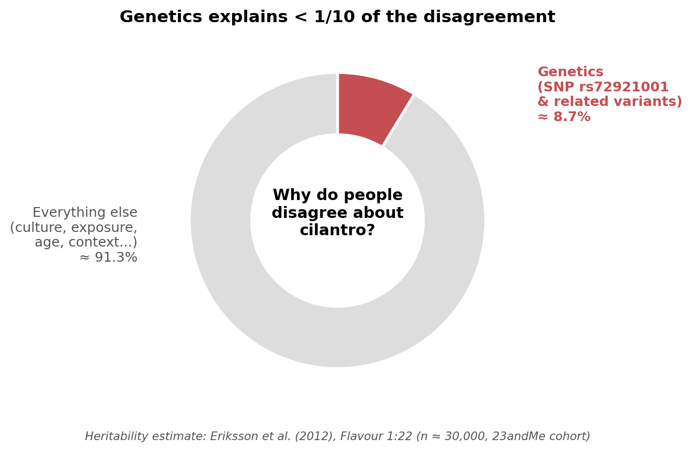

# Why Does Cilantro Taste Like Soap to Some People — and Like Summer to Others?

*A scientific exploration of the genetic and cultural forces behind one of the world's most divisive herbs.*

---

## A herb that splits the dinner table

Few foods generate as much disagreement as cilantro (also called coriander leaf, *Coriandrum sativum*). For roughly four out of every five diners, a sprinkle of these bright green leaves brings citrus, freshness and a hint of pepper to a bowl of pho or a plate of tacos. For the unlucky minority, the same leaves taste like dish-soap, metal, or — as the writer Julia Child once famously claimed — something you would scrape off the side of a bug [1]. The split is not subtle: it has launched anti-cilantro websites, viral memes and even a Facebook group called "I Hate Coriander" with hundreds of thousands of members [1].

Behind the jokes lies a genuine scientific puzzle: why does the same molecule, landing on two human tongues, produce two opposite experiences? Two leading explanations compete. The first looks inward, at our DNA; the second outward, at the kitchens we grew up in. Deciding which matters more is not just a curiosity for foodies — it touches on how we draw the line between "nature" and "nurture" in everyday perception, and on whether you can teach yourself to like a food you currently can't stand.

## The science in one bite

The flavour of cilantro comes mostly from a class of chemicals called **unsaturated aldehydes**, especially (E)-2-alkenals and (E)-2-alkenols [1], [2]. These same aldehydes are produced by some soaps, certain insects and the leaves of stink-bugs, which is why the "soapy" or "buggy" descriptor keeps appearing in surveys [1]. When we chew a coriander leaf, the volatile aldehydes rise into the back of the nose and bind to **olfactory receptors** — tiny proteins on the surface of nerve cells in the nasal cavity. Each receptor responds to a particular shape of molecule. The brain then assembles the pattern of activated receptors into what we call a "flavour" [3].

Why does this matter? Because olfaction is the dominant sense in flavour perception, and because olfactory-receptor genes form the **largest gene family in the human genome**, with hundreds of variants differing between any two people [3], [7]. That variation is the doorway through which both genetics *and* culture can walk in to shape what your dinner tastes like.

## Perspective 1 — "It's mostly in your genes"

The strongest evidence for the genetic perspective comes from a 2012 genome-wide association study (GWAS) by Eriksson and colleagues, who scanned the DNA of nearly 30,000 people of European ancestry recruited through the consumer-genetics company 23andMe [2]. They found that a single nucleotide polymorphism, **rs72921001**, sitting in a cluster of olfactory-receptor genes on chromosome 11, was significantly associated with describing cilantro as soapy (p ≈ 6.4 × 10⁻⁹) [2]. Of the receptors in that cluster, **OR6A2** stood out: it binds exactly the kind of aldehydes that dominate cilantro's aroma [2]. More recent work has placed this finding inside a much bigger picture. Trimmer et al. (2019) tested over 300 people against 70 odours and showed that genetic variation across the human olfactory-receptor repertoire systematically alters how strong, pleasant or identifiable each smell is [3]; Li et al. (2022) extended this with functional assays, confirming that single-receptor variants can flip an odour from "musky and pleasant" to "stinky and intolerable" for the carrier [7]. Within that wider map, Spence's 2023 review confirms that OR6A2 remains the single best-supported molecular explanation for cilantro's soap effect [1].

**Critiquing the evidence.** On its face the genetic story is compelling: a named receptor, a named SNP, a huge sample, and a chemically plausible mechanism. Yet the evidence is also narrower than it first appears. Eriksson et al. themselves estimated the *heritability* of cilantro dislike at only about **8.7%** [2]. In plain language, even if we knew everyone's full genome, we could explain less than one tenth of why people disagree about coriander. The replication cohort in the same study found the SNP added only a 0.4-unit shift on an 11-point liking scale [2] — statistically real, gastronomically tiny. Newer GWAS work tells the same cautionary story at scale: across dozens of odours, individual receptor variants typically explain only a few percent of perceptual variance, with the rest distributed across many genes and, crucially, non-genetic factors [3], [7]. The cilantro study population was also overwhelmingly European; whether rs72921001 carries the same weight in East Asian, African or Latin-American genomes is, as Spence cautions, "still effectively untested at scale" [1]. The gene is real and the receptor is real — but treating *OR6A2* as the lone villain overstates what the data actually show.

*Figure 1. Even on the genetic camp's own best estimate, DNA accounts for less than one-tenth of why people disagree about cilantro. The remaining ~91% lies outside the genome. Data: Eriksson et al. (2012) [2].*

## Perspective 2 — "It's mostly in your kitchen"

The second perspective starts from a striking observation: dislike of cilantro tracks the world's culinary map almost as cleanly as it tracks any gene. In a survey of 1,639 young adults in Toronto, Mauer and El-Sohemy found dislike rates of **21% in East Asians, 17% in people of European descent, 14% in those of African descent, 7% in South Asians, 4% in Hispanics and just 3% in Middle Eastern participants** [4]. The cuisines at the bottom of that list — Mexican, Indian, Levantine, Vietnamese, Thai — are precisely the ones where cilantro appears in childhood meals almost daily. The cuisines at the top use it rarely or not at all. A 2025 large-scale analysis of more than a million online recipes from China, the United States and Germany reached the same conclusion at planetary scale: flavour profiles are learned, locally clustered, and shift over a single generation as immigration and global food media spread new ingredients [5].

*Figure 2. Cilantro dislike varies roughly seven-fold across ethnocultural groups, tracking the prominence of cilantro in each cuisine far more cleanly than any single gene variant could. Data: Mauer & El-Sohemy (2012) [4].*

This pattern fits a well-documented psychological mechanism known as the **mere-exposure effect** and **flavour learning**: repeated, low-stakes encounters with a food, especially in early childhood and in pleasant social contexts, gradually move it from "novel" toward "preferred" [6]. Anecdotal but widely reported is the testimony of self-described cilantro-haters who, after deliberately cooking with it for several weeks, report the soapy character fading into the background and the citrus note coming forward [1].

**Critiquing the evidence.** The cultural perspective explains what the genetic one cannot: the geography of dislike, the fact that adults can change their minds, and the within-family disagreements that no SNP could account for. But it has weaknesses of its own. Mauer and El-Sohemy's ethnocultural categories are coarse and partly confounded with genetic ancestry — a Hispanic Torontonian and an East Asian Torontonian differ in *both* their cuisines and their allele frequencies [4]. The recipe-database study by Zhang et al. measures what cooks *publish*, not what eaters *enjoy* [5]. And while the mere-exposure effect is robust in controlled experiments with neutral stimuli, evidence that it can override a strong, genetically amplified soapy percept is mostly anecdotal [1], [6]. In short, culture clearly bends the curve — but how far it can bend a chemically intense aversion remains an open empirical question.

## So which perspective wins?

Putting the two bodies of evidence side by side, my own view is that the **cultural-exposure perspective is the more powerful explanation, and the genetic one has been over-sold**. The numbers force this conclusion. Genetics, on its proponents' best estimate, accounts for under 10% of why people disagree about cilantro [2], and similarly modest effect sizes turn up across the wider olfactory genome [3], [7]. The remaining 90+% sits in territory that the geographic data — a sevenfold gap in dislike rates between Middle Eastern and East Asian diners [4], echoed in the global recipe map of Zhang et al. [5] — describes far better than any SNP. Genetics should be read as a small **sensitivity bias**: rs72921001 carriers pick up the soapy aldehydes a little more easily [1], [2]. Culture then does the heavy lifting of deciding what the brain *makes* of that signal, and culture is plastic in a way that DNA is not [6].

## Conclusion: your tongue is not broken

If you are a cilantro-hater reading this, here is the one sentence to take away: **your dislike is overwhelmingly a learned habit, not a fixed feature of who you are**. The headline gene explains less than a tenth of the disagreement; the rest is written in the meals you grew up with and the meals you have not yet tried often enough [2], [4], [5], [6]. That matters beyond dinner. Cilantro is a small case study in a much larger habit of modern thinking — the reflex to reach for a gene whenever we want to explain a difference between people. The science of one divisive herb says, gently but firmly, that this reflex overshoots [1], [3], [7]. So next time someone tells you cilantro tastes like soap and "it's just genetics," hand them a bowl of pho, smile, and offer them the longer, more interesting version of the truth.

---

## References

[1] C. Spence, "Coriander (cilantro): A most divisive herb," *International Journal of Gastronomy and Food Science*, vol. 33, p. 100779, 2023, doi: 10.1016/j.ijgfs.2023.100779.

[2] N. Eriksson, S. Wu, C. B. Do, A. K. Kiefer, J. Y. Tung, J. L. Mountain, D. A. Hinds, and U. Francke, "A genetic variant near olfactory receptor genes influences cilantro preference," *Flavour*, vol. 1, no. 22, 2012, doi: 10.1186/2044-7248-1-22.

[3] C. Trimmer, A. Keller, N. R. Murphy, L. L. Snyder, J. R. Willer, M. H. Nagai, N. Katsanis, L. B. Vosshall, H. Matsunami, and J. D. Mainland, "Genetic variation across the human olfactory receptor repertoire alters odor perception," *Proceedings of the National Academy of Sciences*, vol. 116, no. 19, pp. 9475–9480, 2019, doi: 10.1073/pnas.1804106115.

[4] L. Mauer and A. El-Sohemy, "Prevalence of cilantro (*Coriandrum sativum*) disliking among different ethnocultural groups," *Flavour*, vol. 1, no. 8, 2012, doi: 10.1186/2044-7248-1-8.

[5] Q. Zhang, D. Elsweiler, and C. Trattner, "Decoding global palates: Unveiling cross-cultural flavor preferences through online recipes," *Foods*, vol. 14, no. 8, p. 1411, 2025, doi: 10.3390/foods14081411.

[6] D. V. Byrne, "Current trends in food health and safety in cross-cultural sensory and consumer science," *Foods*, vol. 10, no. 5, p. 965, 2021, doi: 10.3390/foods10050965.

[7] B. Li, M. Kamarck, Q. Peng, F.-L. Lim, A. Keller, M. M. Smeets, J. D. Mainland, and S. Wang, "From musk to body odor: Decoding olfaction through genetic variation," *PLOS Genetics*, vol. 18, no. 2, p. e1009564, 2022, doi: 10.1371/journal.pgen.1009564.
