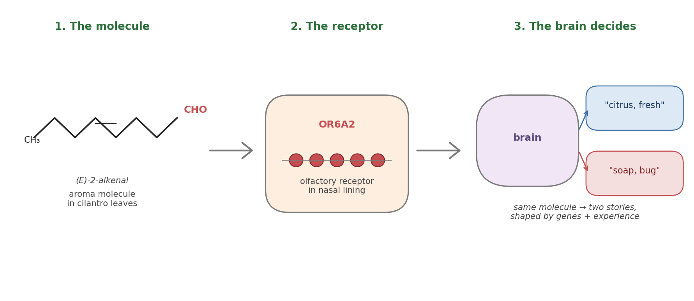
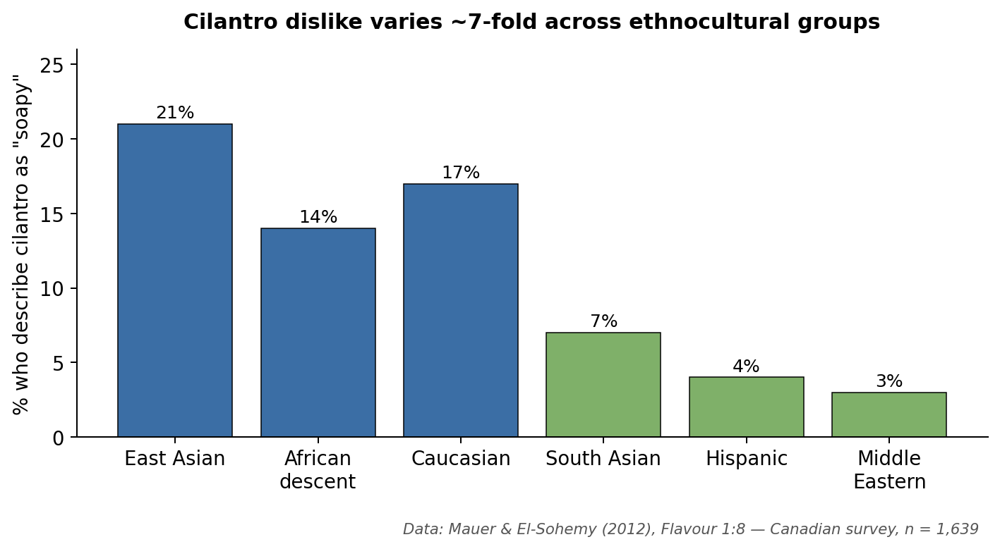

# Why Does Cilantro Taste Like Soap to Some People — and Like Summer to Others?

*The herb that turns dinner tables into debate clubs — and what it quietly tells us about the limits of "blame your genes."*

---

## The herb that splits the table

Order pho with five friends and watch what happens. Three dive in. One fishes the green flecks out and pushes them to the rim. The fifth pulls a face and announces, possibly louder than necessary, that the soup tastes like Palmolive. Cilantro — coriander leaf, if you grew up British — has a way of doing that. Julia Child once said on national television that she would pick it out of a dish and "throw it on the floor" [1]; a Facebook group called *I Hate Coriander* has hundreds of thousands of members and an actual manifesto [1]. No other salad garnish has its own hate club.

The interesting question isn't *who* hates it but *why the same leaf produces two opposite experiences*. The popular dinner-party answer — "oh, it's genetic, you either have the gene or you don't" — is half-true at best, and the real story is more flattering to your tongue.

## The science in one bite

Most of cilantro's smell comes from **unsaturated aldehydes** — long, kinked carbon chains with a reactive tip. The same kind of molecule shows up in some soaps and on certain stink-bugs, which is the chemistry behind the famous complaint [1], [2]. When you chew a leaf, those molecules drift up the back of your nose and dock onto **olfactory receptors**, tiny proteins on nerve cells in your nasal lining. Each receptor is shaped to grip a particular kind of molecule, and your brain reads the pattern of which receptors fired — *that* pattern is what we casually call a "flavour" [3].

*Figure 1. From leaf to verdict in three steps. The same molecule reaches the same receptor in everyone's nose — yet the brain that interprets the signal can land on "citrus" or on "soap" depending on both genetic tuning and a lifetime of meals.*

Two facts matter for what follows. First, smell is doing most of the work; "taste" is mainly an aroma puzzle. Second, the genes that build olfactory receptors are the **largest gene family in the human genome**, with hundreds of versions that quietly differ between people [3], [7] — the door through which both genetics *and* culture walk in.

## The gene that gets too much credit

The genetic story has a hero study. In 2012, Eriksson and colleagues at 23andMe scanned the DNA of nearly 30,000 customers and asked a simple question: who said cilantro tasted soapy? One variant — **rs72921001**, a single-letter spelling change next to a cluster of olfactory-receptor genes on chromosome 11 — lit up clearly above the noise [2]. One receptor in that cluster, **OR6A2**, happens to grip exactly the aldehydes that dominate cilantro's aroma [2]. Newer work has reinforced the pattern: Trimmer and colleagues showed in 2019 that small genetic differences in the human nose systematically tilt how strong and pleasant dozens of everyday smells are [3], and Li and colleagues confirmed in 2022 that flipping a single letter in a single receptor can flip an odour from "musky and pleasant" to "stinky and unbearable" [7]. Spence's 2023 review still names OR6A2 as the best-supported molecular fingerprint behind the soap complaint [1].

It is a clean story — until you read the small print. Eriksson's own paper estimated that genetics, all of it together, explains about **8.7%** of the disagreement over cilantro [2]. Not 87. *Eight point seven.* In their replication group, carrying the "soapy" variant nudged people only 0.4 of a point on an 11-point liking scale — statistically real, gastronomically tiny [2]. Newer large-scale studies tell the same story across many odours: single receptor variants typically account for only a few percent each [3], [7]. The 23andMe sample was also almost entirely European, and whether rs72921001 carries the same weight in East Asian, African or Latin-American noses is, as Spence puts it, "still effectively untested at scale" [1]. The gene is real — but calling OR6A2 the villain is like blaming the doorbell for who came to the party.

## The kitchen that tunes your nose

The other perspective starts from a fact that is hard to un-see: dislike of cilantro tracks the world's culinary map almost as cleanly as any gene. In a survey of 1,639 young adults in Toronto, Mauer and El-Sohemy found that about **21% of East Asian, 17% of European-descent and 14% of African-descent participants** said cilantro tasted soapy — versus only **7% of South Asian, 4% of Hispanic and 3% of Middle Eastern participants** [4]. The cuisines at the bottom of that list — Mexican, Indian, Lebanese, Vietnamese, Thai — are the ones that put cilantro in childhood meals almost daily. A 2025 analysis of more than a million online recipes from China, Germany and the United States reached the same conclusion at planetary scale: flavour profiles are local, learned, and shift within a single generation [5].

*Figure 2. A nearly seven-fold gap in dislike rates between Middle Eastern and East Asian diners — a gap no single gene variant has ever come close to explaining. Data: Mauer & El-Sohemy (2012) [4].*

Underneath the map sits a well-established mechanism: the **mere-exposure effect**. Repeated, low-stakes meetings with a food — especially in childhood, especially in pleasant company — quietly move it from "novel" to "neutral" to "preferred" [6]. It is why almost no one is born loving black coffee or blue cheese, and why cilantro-haters who deliberately cook with it for a few weeks often report the soapy note receding and a citrus note stepping forward [1]. None of this knocks out the gene story — Mauer and El-Sohemy's ethnocultural categories partly mirror genetic ancestry [4], and whether mere-exposure can fully overwrite a strong soapy sensation remains mostly anecdotal [1], [6]. *How far* culture can bend a chemically intense aversion is the genuinely open question.

## Where genes end and kitchens begin

Lay them side by side and the math ends the argument. Genetics — on its own proponents' best estimate — explains under a tenth of the disagreement [2], with similarly modest effects across the wider olfactory genome [3], [7]. The other 90% lives in territory the geographic data describes far better [4], [5]. The cleanest synthesis: genetics gives you a small **sensitivity dial** — if you carry rs72921001, the aldehydes ring a little louder [1], [2]. Culture decides what music your brain plays them as, and culture is far more plastic than DNA will ever be [6].

## The story we keep buying

There is an irony in where the cilantro number came from. That 8.7% — the figure that takes the air out of the gene-versus-tongue drama — was published by 23andMe [2], a company whose business model rests on the opposite implication: that the answer to *why are you the way you are* is sitting in your saliva, waiting to be unsealed for a hundred dollars. They ran the experiment honestly and reported the result honestly. Even for a reaction as loud as cilantro-as-soap, the genome's share of the argument rounds to *not very much* — and the marketing around consumer DNA has, for fifteen years, kept the lights off in that corner.

Cilantro is the cleanest, smallest version of a story we keep being sold about ourselves. *Bad at maths because of my genes. An introvert because of my genes. Anxious — it's how I was born.* The claims feel scientific because there is a real paper attaching a real DNA variant to a sliver of why people differ; they are popular because, like *I just don't like cilantro*, they close a conversation we'd rather not have. What the cilantro literature does is strip the costume off the trick. Same molecule, same receptor, a named gene [2], [7] — and still nine-tenths of the disagreement lives downstream of biology, in the kitchens that taught us what to find normal [4], [5], [6]. If we are willing, over a bowl of pho, to mistake *I was not served this enough* for *my body rejects it*, the harder question is what else we are mistaking on the same terms — and whose business it is to keep us mistaking it. There is a hopeful flip side to that same number: if most of the dislike is habit, then most of it is also yours to change — one meal at a time.

## Your tongue isn't broken

If you've spent years telling people you "have the cilantro gene," the science is gently asking you to drop the costume. Less than a tenth of your dislike is written in your DNA; the rest is written in the meals you grew up with — and, more importantly, in the meals you have not yet had often enough [2], [4], [5], [6]. That is a hopeful finding: a herb you currently can't stand is not a verdict from biology but a habit your kitchen can rewrite. So the next time someone swears it tastes like soap and shrugs, *"it's genetics, what can you do,"* you can hand them a second taco, smile, and tell them the truth: their tongue isn't broken — it's just under-travelled.

---

## References

[1] C. Spence, "Coriander (cilantro): A most divisive herb," *International Journal of Gastronomy and Food Science*, vol. 33, p. 100779, 2023, doi: 10.1016/j.ijgfs.2023.100779.

[2] N. Eriksson, S. Wu, C. B. Do, A. K. Kiefer, J. Y. Tung, J. L. Mountain, D. A. Hinds, and U. Francke, "A genetic variant near olfactory receptor genes influences cilantro preference," *Flavour*, vol. 1, no. 22, 2012, doi: 10.1186/2044-7248-1-22.

[3] C. Trimmer, A. Keller, N. R. Murphy, L. L. Snyder, J. R. Willer, M. H. Nagai, N. Katsanis, L. B. Vosshall, H. Matsunami, and J. D. Mainland, "Genetic variation across the human olfactory receptor repertoire alters odor perception," *Proceedings of the National Academy of Sciences*, vol. 116, no. 19, pp. 9475–9480, 2019, doi: 10.1073/pnas.1804106115.

[4] L. Mauer and A. El-Sohemy, "Prevalence of cilantro (*Coriandrum sativum*) disliking among different ethnocultural groups," *Flavour*, vol. 1, no. 8, 2012, doi: 10.1186/2044-7248-1-8.

[5] Q. Zhang, D. Elsweiler, and C. Trattner, "Decoding global palates: Unveiling cross-cultural flavor preferences through online recipes," *Foods*, vol. 14, no. 8, p. 1411, 2025, doi: 10.3390/foods14081411.

[6] D. V. Byrne, "Current trends in food health and safety in cross-cultural sensory and consumer science," *Foods*, vol. 10, no. 5, p. 965, 2021, doi: 10.3390/foods10050965.

[7] B. Li, M. Kamarck, Q. Peng, F.-L. Lim, A. Keller, M. M. Smeets, J. D. Mainland, and S. Wang, "From musk to body odor: Decoding olfaction through genetic variation," *PLOS Genetics*, vol. 18, no. 2, p. e1009564, 2022, doi: 10.1371/journal.pgen.1009564.
